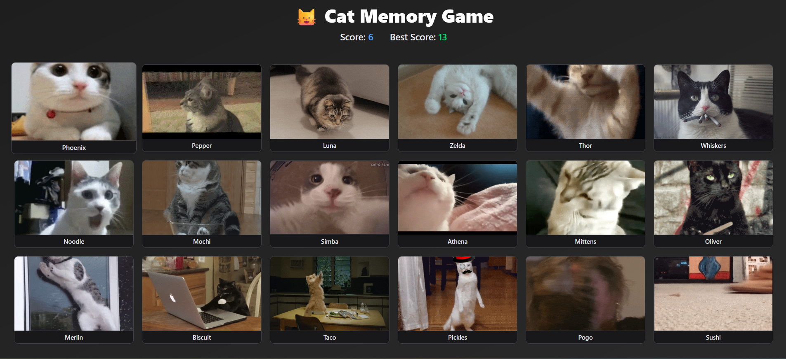

# 🐱 Cat Memory Game

A fun and interactive memory game built with **React** using the **Giphy API** to fetch adorable cat GIFs! Flip the cards, avoid repeating, and try to beat your high score. Built with custom React components, hooks, and a clean UI.

## 🚀 Features

- 🔁 18 unique cat GIF cards, shuffled every turn  
- ✅ Keeps track of current and best scores  
- 🎯 Fully responsive and mobile-friendly design  
- 🖼️ Fetches live data from Giphy API  
- 🧠 Simple but addictive gameplay  
- 🌙 Modern dark UI theme  
- 🌀 Loading indicators while fetching data  

## 🛠️ Technologies Used

- React  
- Tailwind CSS  
- Giphy API  
- JavaScript (ES6+)  
- Vite  

## 🧠 Game Rules

- Click a card you haven't clicked before.  
- Every correct click increases your score.  
- Clicking the same card twice resets your score.  
- Try to beat your best score!

## 👨‍💻 Author

Developed with ❤️ by  
[Mainul Islam](https://github.com/Mainul-Islam-Nirob)

## 📄 License

This project is licensed under the MIT License.
